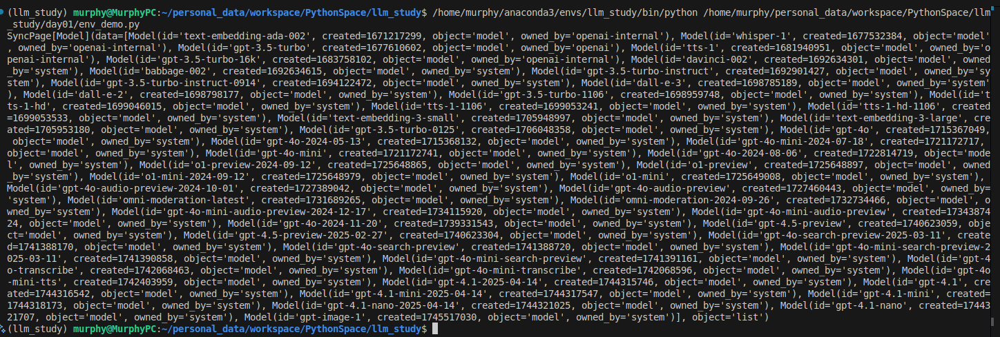
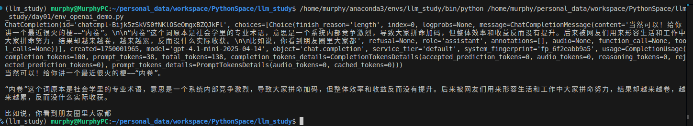

# LLM 学习笔记 - Day01

## 课程综合

### 一、API申请与本地配置

#### 1. env文件

.env 文件的结构像这样： KEY=VALUE ，每一行一个变量。比如：

```env
DB_USER=root
DB_PASSWORD=secret
```

在使用时需加载 .env 文件。可以使用 Python 的 dotenv 模块来实现。

```python
# 引入 dotenv 模块
from dotenv import load_dotenv, find_dotenv
# 加载 .env 到环境变量
_ = load_dotenv(find_dotenv())

```

它存在的主要目的是为了管理应用的配置信息，提高安全性和灵活性。通过它可以轻松地根据不同环境调整配置，而不需要修改代码，提高开发效率。同时也因为键值对的缘故，导致它无法维护管理同一接口不同实现的同键值名变量，那么都是 api_key 就需要使用不同的变量名，比如 api_key_a 和 api_key_b ，这样会导致变量名过长或数量膨胀，不方便管理使用。而 config.ini 文件则可以解决这个问题,因为 ini 文件支持分区键值对，也即允许不同分区下的变量名是相同的，所以 api_key 只需要一个变量名，就可以实现不同实现同键值名变量的维护。

#### 2. config.ini文件

`ini`文件的格式如下：

```ini
[section_interface_1]
api_key = sk-1234567890

[section_interface_2]
api_key = sk-abcdefghijklmnopqrstuvwxyz

```

使用 Python 的 configparser 模块来读取 ini 文件：

```python
import configparser

config = configparser.ConfigParser()
config.read('config.ini')

api_key = config['section_interface_1']['api_key']
```

#### 3. 使用 socks5 代理访问 openai

由于众所周知的原因，我们只能使用科学上网使用 openai 提供的大模型，这里以 socks5 为例，给出 openai 配置 socks5 的代码示例。配置使用它之前
需要安装相应软件`pip install openai requests[socks]`。

```python
# 使用 socks5h 而不是 socks5（让域名解析走代理）
socks5_proxy = "socks5h://127.0.0.1:1080"
# 设置 SOCKS5 代理（使用环境变量）
os.environ['HTTP_PROXY'] = socks5_proxy
os.environ['HTTPS_PROXY'] = socks5_proxy
```

### 二、使用不同的API调用方式实现模型调用

**1. OpenAI[翻墙直连]**

这里在 env 文件中配置`OPENAI_API_KEY=sk-proj-jr_xxx`，示例[env_demo.py](./env_demo.py)实现了通过 socks5 代理访问 openai ，并查看当前 api_key 账号下可用的模型列表。



另一个示例[env_openai_demo.py](./env_openai_demo.py)则是调用具体 openai 模型实现了对话功能。但不知道为什么返回的结果不完整，存在丢 token 的情况。



**2. 代理OpenAI[devagi]**

这里的代理OpenAI是指通过第三方平台来访问OpenAI。它的技术原理如下：

> 1. 你使用第三方平台使用的key 向 第三方平台提供的接口（URL） 发送请求。
> 2. 第三方平台在后台用 它自己的 OpenAI API Key 去访问 OpenAI 的接口。
> 3. 第三方服务器将 OpenAI 的响应再“转发”给你。

示例[proxy_openai](./proxy_openai.py)实现了通过 devagi 代理访问 openai ，并调用具体 openai 模型实现了对话功能。

**3. 大模型开发平台[阿里百炼、百度千帆等]**

大模型开发平台（也称LLMOps平台），相较于OpenAI作为一个先进大脑制造商，LLMOps平台更像企业级“AI工厂”，它可以让你快速接入/训练/部署“大脑”。具体来说LLMOps具有如下特点：

| 分类                               | 定义                           |
| -------------------------------- | ---------------------------- |
| **MaaS（Model-as-a-Service）平台** | 提供大模型能力的服务平台，用户通过 API 调用不同模型 |
| **大模型聚合平台**                    | 聚合多个大模型（自研 + 外部），提供统一调用接口    |
| **企业级 LLM 应用开发平台**             | 提供提示词管理、知识库、插件系统、部署方案等       |
| **低代码/无代码开发平台**                | 非技术人员也可以通过图形界面构建大模型应用        |

与OpenAI相比，阿里百炼/百度千帆有如下区别：

| 对比项    | 阿里百炼 / 百度千帆            | OpenAI（GPT-4o 等）        |
| ------ | ---------------------- | ----------------------- |
| 模型能力   | 主打国产大模型（通义、文心等）        | 国际顶级模型，推理质量更优           |
| 网络可访问性 | 国内网络通畅                 | 国内需代理或通过 Azure 接入       |
| 平台定位   | “平台 + 模型 + 应用 + 数据”一体化 | 更偏向“模型 API”本身           |
| 应用搭建工具 | 提供低代码工作流、知识库构建等        | 官方 Playground 有限，需第三方集成 |
| 适用场景   | 企业私有化、政务、制造、教育等本地场景    | 全球化开发、科研、产品迭代           |
| 合规与审查  | 国内政策适配好                | 对中文内容审查宽松但政策不兼容         |

这里以阿里百炼为例。
示例[dashscope_api](./dashscope_api.py)实现了通过阿里百炼及其提供的接口标准访问相应模型实现了对话功能。
示例[dashscope_openai_api](./dashscope_openai_api.py)实现了通过阿里百炼及其提供的openai接口标准访问相应模型实现了对话功能。]
示例[dashscope_oth](./dashscope_oth.py)实现了通过阿里百炼及其提供的接口标准访问deepseek模型实现了对话功能。

4. 本地Ollama
示例[ollama_ds](./ollama_ds.py)实现了通过ollama调用本地部署的deepseek模型实现了对话功能。

### 三、大模型接口标准

“大模型接口标准”是指**不同大语言模型（LLMs）服务商提供的 API 在调用方式上的统一或约定**，以便开发者能更方便地调用各种模型进行问答、生成、推理等任务。

虽然目前**尚未有全球强制统一的接口标准**，但有一些**事实上的主流接口规范**，尤其以 **OpenAI 的 Chat Completions 接口** 为基础，很多平台已经在向这个格式靠拢。特别是生成补全接口：

**`POST /v1/chat/completions` 接口**

**请求参数标准结构：**

```json
{
  "model": "gpt-4",
  "messages": [
    {"role": "system", "content": "你是一个助手"},
    {"role": "user", "content": "中国的首都是哪里？"}
  ],
  "temperature": 0.7,
  "max_tokens": 2048,
  "stream": false
}
```

**参数说明：**

| 字段            | 含义                    | 是否必须 |
| ------------- | --------------------- | ---- |
| `model`       | 模型名称（如 gpt-4、glm-4 等） | 是  |
| `messages`    | 对话上下文数组               | 是  |
| `temperature` | 随机性控制，0-1之间           | 可选   |
| `max_tokens`  | 最多返回多少个token          | 可选   |
| `stream`      | 是否开启流式输出              | 可选   |

**响应格式（非流式）：**

```json
{
  "id": "chatcmpl-123",
  "object": "chat.completion",
  "choices": [
    {
      "index": 0,
      "message": {
        "role": "assistant",
        "content": "中国的首都是北京。"
      },
      "finish_reason": "stop"
    }
  ],
  "usage": {
    "prompt_tokens": 10,
    "completion_tokens": 7,
    "total_tokens": 17
  }
}
```

### 四、其他与接口相关内容

#### 1. 国产模型接口标准化趋势

目前国产主流模型平台都支持 **类 OpenAI 标准接口** 或在此基础上扩展：

| 平台                 | 接口兼容性            | 说明                                |
| ------------------ | ---------------- | --------------------------------- |
| 百度千帆               | ✅ 高度兼容 OpenAI 标准 | 支持 messages 格式和多轮对话               |
| 阿里百炼               | ✅ 支持 OpenAI 风格调用 | 也支持多轮历史                           |
| 通义千问 API           | ✅ 与 OpenAI 类似格式  | 参数字段略有不同（如 `input` 替代 `messages`） |
| MiniMax / Moonshot | ✅ 基本兼容           | 自带工具调用结构                          |
| 智谱GLM              | ✅ 类 OpenAI 标准    | 支持对话和流式输出                         |
| 百川 / 深度求索 / 华为盘古   | ✅ 趋于统一           | 新平台都支持 messages 格式                |

---

#### 2. 接口标准化的演进方向

未来可能形成的统一标准包括：

| 标准提议                                 | 说明                                   |
| ------------------------------------ | ------------------------------------ |
| **OpenAI-style Chat API**            | 实际上已经成为主流事实标准                        |
| **Open LLM API schema**              | 社区尝试统一 API 调用格式（如 LangChain、OpenLLM） |
| **ML Schema / JSON Schema for LLMs** | 对输入输出做结构化定义，适用于多语言、多模态模型             |
| **LangChain / LLMRouter 适配规范**       | 在工具层做兼容（如自动路由调用不同 LLM）               |

---

#### 3. 接口兼容工具（推荐）

如果你想调用多个模型而不修改代码，可以用以下中间层或工具：

| 工具/平台                        | 功能                 |
| ---------------------------- | ------------------ |
| **LangChain**                | 兼容多家模型 API，可动态路由请求 |
| **OpenLLM**                  | 提供本地部署的大模型统一 API   |
| **llama-index**              | 构建RAG应用，支持多模型接入    |
| **Gradio / FastAPI Wrapper** | 用于构建统一API层或测试UI    |
